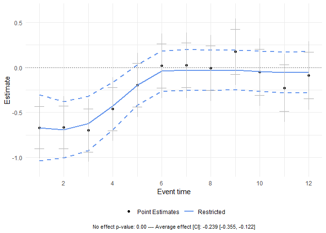

# plausibounds

<!-- badges: start -->

[](https://CRAN.R-project.org/package=plausibounds)
[](https://r-pkg.org/pkg/plausibounds)
<!-- badges: end -->

## Overview

The `plausibounds` package implements the additions to dynamic effect
plots suggested in [Freyaldenhoven and Hansen
(2026)](https://simonfreyaldenhoven.github.io/papers/Plausible_bounds.pdf).
Data-driven smoothing delivers a smooth estimated path with potentially
improved point estimation properties and confidence regions covering a
surrogate that can be substantially tighter than conventional pointwise
or uniform bands.

## Installation

``` r
# Install from CRAN
install.packages("plausibounds")

# Install latest version from GitHub
install.packages("devtools")
devtools::install_github("SimonFreyaldenhoven/plausibounds")
```

## Usage

Find a minimal example below. For more information see the package
[documentation](https://cran.r-project.org/package=plausibounds/plausibounds.pdf)
and
[vignette](https://cran.r-project.org/package=plausibounds/vignettes/documentation.html).

``` r
library(plausibounds)

# Load example data
data(estimates_bighump)
data(var_bighump)

set.seed(916)

# Compute restricted bounds
pb <- plausible_bounds(
  estimates = estimates_bighump[1:12],
  var = var_bighump[1:12, 1:12]
)
```

``` r
# View results
summary(pb)
#> Summary of Plausible Bounds Results
#> -----------------------------------
#> 
#>  horizon  unrestr_est   restr_est restr_lower restr_upper
#>        1 -0.644857526 -0.65289039 -1.01968259 -0.28609819
#>        2 -0.787000641 -0.74451476 -1.05826109 -0.43076844
#>        3 -0.675417155 -0.63299852 -0.94559699 -0.32040004
#>        4 -0.317197460 -0.39668676 -0.68835820 -0.10501531
#>        5 -0.262353065 -0.17237281 -0.42877595  0.08403033
#>        6  0.002879266  0.04037154 -0.18158946  0.26233254
#>        7  0.189086269  0.16708990 -0.06613510  0.40031489
#>        8  0.202281931  0.16777565 -0.06568888  0.40124018
#>        9  0.210778688  0.16762896 -0.06578817  0.40104609
#>       10  0.221185124  0.16767121 -0.06577340  0.40111581
#>       11  0.230834836  0.16766272 -0.06580571  0.40113115
#>       12  0.120426905  0.16738237 -0.06610411  0.40086886

# Visualize bounds
create_plot(pb)
```

<!-- -->

``` r
# Example with parallel processing
pb_parallel <- plausible_bounds(
  estimates = estimates_bighump,
  var = var_bighump,
  alpha = 0.05,
  parallel = TRUE,
  n_cores = 4
)
```

## Citation

Simon Freyaldenhoven, Christian Hansen. “(Visualizing) Plausible
Treatment Effect Paths.” Federal Reserve Bank of Philadelphia and
University of Chicago, 2026.

Simon Freyaldenhoven, Christian Hansen, Ryan Kobler. “`plausibounds`
package.” Code and data repository at
<https://github.com/SimonFreyaldenhoven/plausibounds>, 2026.
