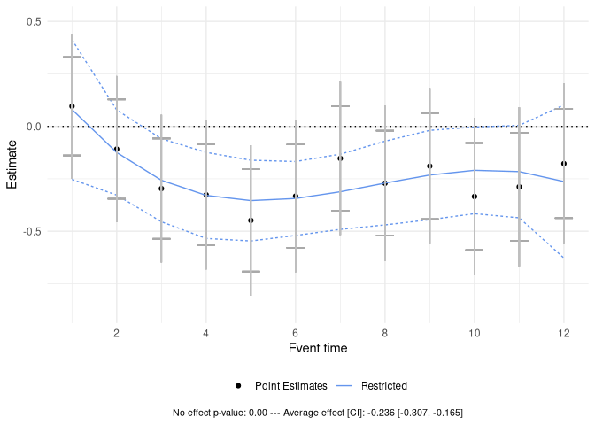

# plausibounds

<!-- badges: start -->

[](https://CRAN.R-project.org/package=plausibounds)
[](https://r-pkg.org/pkg/plausibounds)
<!-- badges: end -->

## Overview

The `plausibounds` package implements methods from [Freyaldenhoven and
Hansen
(2026)](https://simonfreyaldenhoven.github.io/papers/Plausible_bounds.pdf)
to compute restricted bounds for treatment path estimates from event
studies and dynamic panel data models. The package provides an
alternative solution between pointwise confidence intervals and uniform
confidence bands through data-driven surrogate paths that adapt to
smoothness and correlation structure.

## Installation

``` r
# Install from CRAN
install.packages("plausibounds")

# Install latest version from GitHub
install.packages("devtools")
devtools::install_github("SimonFreyaldenhoven/plausibounds")
```

## Usage

Find a minimal example below. For more information see the package
[documentation](https://cran.r-project.org/package=plausibounds/plausibounds.pdf)
and
[vignette](https://cran.r-project.org/package=plausibounds/vignettes/documentation.html).

``` r
library(plausibounds)
library(ggplot2)

# Load example data
data(estimates_wiggly)
data(var_iid)

# Compute restricted bounds
pb <- plausible_bounds(
  estimates = estimates_wiggly,
  var = var_iid
)
#> Calculating restricted bounds: ■■■■■■                           K = 2/11 [ 18%]Calculating restricted bounds: ■■■■■■■■■                        K = 3/11 [ 27%]Calculating restricted bounds: ■■■■■■■■■■■■                     K = 4/11 [ 36%]Calculating restricted bounds: ■■■■■■■■■■■■■■■                  K = 5/11 [ 45%]Calculating restricted bounds: ■■■■■■■■■■■■■■■■■                K = 6/11 [ 55%]Calculating restricted bounds: ■■■■■■■■■■■■■■■■■■■■             K = 7/11 [ 64%]Calculating restricted bounds: ■■■■■■■■■■■■■■■■■■■■■■■          K = 8/11 [ 73%]Calculating restricted bounds: ■■■■■■■■■■■■■■■■■■■■■■■■■■       K = 9/11 [ 82%]Calculating restricted bounds: ■■■■■■■■■■■■■■■■■■■■■■■■■■■■     K = 10/11 [ 91%]Calculating restricted bounds: ■■■■■■■■■■■■■■■■■■■■■■■■■■■■■■■  K = 11/11 [100%]

# View results
summary(pb)
#> Summary of Plausible Bounds Results
#> -----------------------------------
#> 
#>  horizon        coef   surrogate restr_lower  restr_upper
#>        1  0.09554212  0.08003022  -0.2527747  0.412835169
#>        2 -0.10861223 -0.12484663  -0.3276764  0.077983159
#>        3 -0.29680478 -0.25702728  -0.4548122 -0.059242328
#>        4 -0.32634657 -0.32916484  -0.5343129 -0.124016817
#>        5 -0.44833415 -0.35391239  -0.5462388 -0.161585995
#>        6 -0.33276043 -0.34392303  -0.5199829 -0.167863120
#>        7 -0.15294343 -0.31184986  -0.4910514 -0.132648319
#>        8 -0.27116602 -0.27034598  -0.4697459 -0.070946071
#>        9 -0.18957586 -0.23206449  -0.4449509 -0.019178092
#>       10 -0.33455712 -0.20965848  -0.4161487 -0.003168222
#>       11 -0.28824851 -0.21578106  -0.4359691  0.004406975
#>       12 -0.17782216 -0.26308531  -0.6277410  0.101570332

# Visualize bounds
create_plot(pb)
```

<!-- -->

``` r
# Example with parallel processing
pb_parallel <- plausible_bounds(
  estimates = estimates_wiggly,
  var = var_iid,
  alpha = 0.05,
  parallel = TRUE,
  n_cores = 4
)
```

## Citation

Simon Freyaldenhoven, Christian Hansen. “(Visualizing) Plausible
Treatment Effect Paths.” Federal Reserve Bank of Philadelphia and
University of Chicago, 2025.

Ryan Kobler. “`plausibounds` package.” Code and data repository at
<https://github.com/SimonFreyaldenhoven/plausibounds>, 2025.
