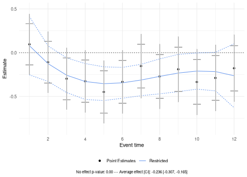
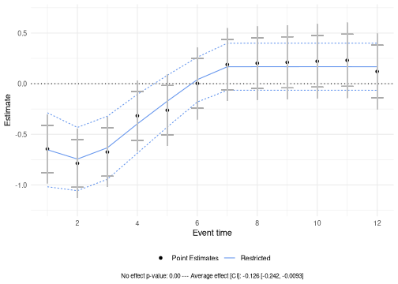
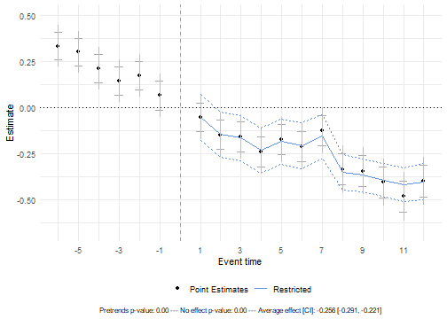
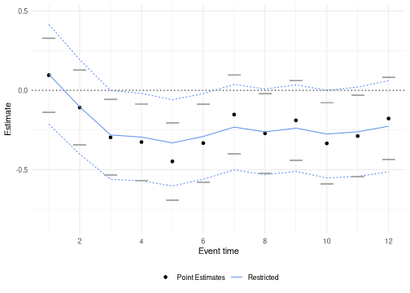

``` r
library(plausibounds)
library(ggplot2)
```

## Overview

When estimating treatment effect paths from event studies or dynamic panel data models, researchers often face a tension: pointwise confidence intervals fail to account for multiple testing, while uniform confidence bands (such as sup-t bands) can be too wide to provide useful inference. The `plausibounds` package implements methods from Freyaldenhoven and Hansen (2025) that provide an intermediate solution through *restricted bounds*: confidence regions that adapt to the smoothness and correlation structure of the data with valid post-selection coverage.

## Background

Let $\hat{\beta} = (\hat{\beta}_1, \ldots, \hat{\beta}_H)$ denote estimates of treatment effects at horizons $h=1,\dots,H$, with

$$
\hat{\beta} \sim N(\beta, V_\beta),
$$

where $\beta$ is the true treatment path vector and $V_{\beta}$ is the variance matrix. This setup encompasses common estimators like distributed lag models, local projections, and two-way fixed effects event studies.

### Finding the surrogate path

The key contribution of this research is the construction of restricted bounds via a data-driven "surrogate path." Rather than attempting uniform coverage of the raw estimates, restricted bounds provide valid inference for a smoothed approximation of the true treatment path and thus may better capture policy-relevant features.
The approximation is restricted to a set of reasonable path shapes, and specifically, the dynamic effect is assumed to be (1) smooth and (2) to die off eventually. 

The approach approximates $\beta$ by a *surrogate path* $\beta_M = P(M)\beta$, where $M$ indexes a model in a pre-specified universe $\mathcal{M}$. 
The model universe is specified as follows: it includes polynomial specifications (up to cubic) and penalized smoothing that shrinks first (effect is "smooth") and third (effects "die off") differences. 

Given estimates $\hat{\beta}$, the (non-polynomial) surrogate for a given model $M$ is obtained by solving a penalized least squares problem:

$$
\begin{align}
\tilde{\beta}(M)
&= \tilde{\beta}(\lambda_1, \lambda_2, K) \\
&= \arg\min_{b}\Bigg(
\underbrace{(\hat{\beta}-b)^{\prime}V^{-1}(\hat{\beta}-b)}_{\text{distance from $\hat{\beta}$}}
+\lambda_1\,\underbrace{b^{\prime}D_1^{\prime}W_1(K)D_1 b}_{\text{penalty on first difference after horizon $K$}}
+\lambda_2\,\underbrace{b^{\prime}D_3^{\prime}W_3 D_3 b}_{\text{penalty on third difference}}
\Bigg).
\end{align}
$$

where $D_1$ and $D_3$ are first- and third-difference operators, and $\lambda_1$, $\lambda_2$, and $K$ are tuning parameters that control smoothness and the timing of decay toward zero. The solution has closed form:

$$
\tilde{\beta}(M) = P(M)\hat{\beta}, \quad P(M) = \Big(V_\beta^{-1} + \lambda_1 D_1'W_1(K)D_1 + \lambda_2 D_3'W_3D_3\Big)^{-1} V_\beta^{-1}.
$$

Then, the best-fitting surrogate model $\hat{M}$ is selected by minimizing a BIC-type criterion:

$$
\hat{M} = \arg\min_{M \in \mathcal{M}} \; (\hat{\beta}-\tilde{\beta}(M))'V_\beta^{-1}(\hat{\beta}-\tilde{\beta}(M)) + \log(H)\,\text{df}(M),
$$

where the degrees of freedom is $\text{df}(M) = \mathrm{trace}(P(M))$. 
Therefore, the main algorithm of the package simply iterates over all models in the pre-specified universe to find $\hat{M}$. 

### Post-Selection Inference

Once $\hat{M}$ is chosen, the package constructs confidence regions using post-selection inference (Berk et al. 2013), which accounts for the model selection step to guarantee valid coverage:

$$
\Pr\!\big(\beta_{\hat{M}} \in \text{CR}_{\text{PoSI}}\big) \ge 1-\alpha.
$$

The restricted bounds provide uniform coverage for the *selected surrogate path*, not the true treatment path itself. Because the surrogate is smoother than the raw estimates, this inferential target may be more interpretable for policy analysis.


## Basic Usage

Let's start by examining the structure of the example datasets included in the package:


``` r
# Load example datasets
data(estimates_wiggly)
data(var_iid)
data(var_corr)

# Examine the data structures
print(estimates_wiggly)
#>  [1]  0.09554212 -0.10861223 -0.29680478 -0.32634657 -0.44833415 -0.33276043
#>  [7] -0.15294343 -0.27116602 -0.18957586 -0.33455712 -0.28824851 -0.17782216
dim(var_iid)
#> [1] 12 12
dim(var_corr)
#> [1] 12 12
```

The `estimates_wiggly` vector contains 12 treatment effect estimates at different horizons. The `var_iid` matrix is a diagonal variance-covariance matrix (independent errors), while `var_corr` includes positive correlation across horizons.

### Example 1: Independent Errors

The simplest case uses the `plausible_bounds()` function with just the estimates and variance-covariance matrix. The `alpha` parameter controls the confidence level (default is 0.05 for 95% confidence):


``` r
pb_iid <- plausible_bounds(
  estimates = estimates_wiggly,
  var = var_iid,
  alpha = 0.05
)
#> 
Calculating restricted bounds: ■■■■■■                           K = 2/11 [ 1…

Calculating restricted bounds: ■■■■■■■■■                        K = 3/11 [ 2…

Calculating restricted bounds: ■■■■■■■■■■■■                     K = 4/11 [ 3…

Calculating restricted bounds: ■■■■■■■■■■■■■■■                  K = 5/11 [ 4…

Calculating restricted bounds: ■■■■■■■■■■■■■■■■■                K = 6/11 [ 5…

Calculating restricted bounds: ■■■■■■■■■■■■■■■■■■■■             K = 7/11 [ 6…

Calculating restricted bounds: ■■■■■■■■■■■■■■■■■■■■■■■          K = 8/11 [ 7…

Calculating restricted bounds: ■■■■■■■■■■■■■■■■■■■■■■■■■■       K = 9/11 [ 8…

Calculating restricted bounds: ■■■■■■■■■■■■■■■■■■■■■■■■■■■■     K = 10/11 [ …

Calculating restricted bounds: ■■■■■■■■■■■■■■■■■■■■■■■■■■■■■■■  K = 11/11 [1…
```

The returned object is a list containing the bounds, test statistics, and metadata. The `summary()` method extracts the key results in a tabular format, showing the horizon, original coefficient estimates, surrogate path, and restricted bounds for that path:


``` r
summary(pb_iid)
#> Summary of Plausible Bounds Results
#> -----------------------------------
#> 
#>  horizon        coef   surrogate restr_lower  restr_upper
#>        1  0.09554212  0.08003022  -0.2527747  0.412835169
#>        2 -0.10861223 -0.12484663  -0.3276764  0.077983159
#>        3 -0.29680478 -0.25702728  -0.4548122 -0.059242328
#>        4 -0.32634657 -0.32916484  -0.5343129 -0.124016817
#>        5 -0.44833415 -0.35391239  -0.5462388 -0.161585995
#>        6 -0.33276043 -0.34392303  -0.5199829 -0.167863120
#>        7 -0.15294343 -0.31184986  -0.4910514 -0.132648319
#>        8 -0.27116602 -0.27034598  -0.4697459 -0.070946071
#>        9 -0.18957586 -0.23206449  -0.4449509 -0.019178092
#>       10 -0.33455712 -0.20965848  -0.4161487 -0.003168222
#>       11 -0.28824851 -0.21578106  -0.4359691  0.004406975
#>       12 -0.17782216 -0.26308531  -0.6277410  0.101570332
```

For a more detailed view of the object structure:


``` r
str(pb_iid)
#> List of 8
#>  $ alpha                     : num 0.05
#>  $ preperiods                : num 0
#>  $ wald_test                 :List of 1
#>   ..$ post:List of 2
#>   .. ..$ statistic: num 55.8
#>   .. ..$ p_value  : num 1.29e-07
#>  $ restricted_bounds         :'data.frame':	12 obs. of  5 variables:
#>   ..$ horizon  : int [1:12] 1 2 3 4 5 6 7 8 9 10 ...
#>   ..$ coef     : num [1:12] 0.0955 -0.1086 -0.2968 -0.3263 -0.4483 ...
#>   ..$ surrogate: num [1:12] 0.08 -0.125 -0.257 -0.329 -0.354 ...
#>   ..$ lower    : num [1:12] -0.253 -0.328 -0.455 -0.534 -0.546 ...
#>   ..$ upper    : num [1:12] 0.4128 0.078 -0.0592 -0.124 -0.1616 ...
#>  $ restricted_bounds_metadata:List of 8
#>   ..$ supt_critval      : num 2.85
#>   ..$ supt_b            : num 3.18
#>   ..$ degrees_of_freedom: int 4
#>   ..$ K                 : logi NA
#>   ..$ lambda1           : logi NA
#>   ..$ lambda2           : logi NA
#>   ..$ surrogate_class   : chr "polynomial"
#>   ..$ best_fit_model    :List of 4
#>   .. ..$ estimates_proj: num [1:12, 1] 0.08 -0.125 -0.257 -0.329 -0.354 ...
#>   .. ..$ var_proj      : num [1:12, 1:12] 0.01096 0.005009 0.001171 -0.000937 -0.001697 ...
#>   .. ..$ bic           : num [1, 1] 4.05
#>   .. ..$ model_fit_pval: num [1, 1] 0.853
#>  $ avg_treatment_effect      :List of 4
#>   ..$ estimate: num -0.236
#>   ..$ se      : num 0.0364
#>   ..$ lower   : num -0.307
#>   ..$ upper   : num -0.165
#>  $ pointwise_bounds          :List of 3
#>   ..$ lower  : num [1:12] -0.139 -0.345 -0.536 -0.568 -0.692 ...
#>   ..$ upper  : num [1:12] 0.3298 0.1279 -0.0579 -0.0852 -0.2048 ...
#>   ..$ critval: num 1.96
#>  $ supt_bounds               :List of 3
#>   ..$ lower  : num [1:12] -0.249 -0.457 -0.648 -0.681 -0.807 ...
#>   ..$ upper  : num [1:12] 0.4403 0.2395 0.0547 0.0286 -0.09 ...
#>   ..$ critval: num 2.88
#>  - attr(*, "class")= chr "plausible_bounds"
```

The object contains several components. The `restricted_bounds` data frame is identical to that produced with the `summary()` method. 
The `restricted_bounds_metadata` list stores important information about the model selection process, including the surrogate class selected (e.g., polynomial degree or penalized smoothing parameters), the degrees of freedom, and the sup-t critical value used in constructing the bounds. 
The `avg_treatment_effect` component provides the average treatment effect estimate, its standard error, and confidence interval. 

When arguments `include_pointwise` and `include_supt` of `plausible_bounds()` are `TRUE` (the default), the object also contains `pointwise_bounds` and `supt_bounds` lists with the corresponding confidence bounds. 
Finally, `wald_test` contains test statistics and p-values for testing the joint null hypothesis of no treatment effect.

### Visualization with `create_plot()`

Next let's plot the results:


``` r
create_plot(pb_iid)
```

<div class="figure" style="text-align: center">

<p class="caption">Plausible bounds for treatment path estimates with independent errors</p>
</div>

The plot displays several types of bounds and statistics, each serving a different inferential purpose:

**Point estimates (black dots)**: The original treatment effect estimates $\hat{\beta}_h$ at each horizon. 

**Restricted bounds (blue dashed lines)**: The main contribution of this package. These bounds provide uniform $(1-\alpha)$ coverage for the selected surrogate path (the smooth blue line), not the true treatment path itself. The surrogate path is chosen via BIC from the pre-specified model universe and represents a data-dependent smoothed approximation to the true treatment path. The restricted bounds adapt to the smoothness and correlation structure, often remaining narrower than sup-t intervals.

**Pointwise bounds (gray horizontal bars)**: Standard confidence intervals for each horizon separately, constructed as $\hat{\beta}_h \pm z_{1-\alpha/2} \sqrt{V_{\beta,hh}}$. 

**Sup-t bounds (gray vertical lines)**: Uniform confidence bands that provide $(1-\alpha)$ joint coverage of the entire treatment path. These are constructed using the supremum of $t$-statistics from individual coefficients. Guarantee full-path coverage but can become quite wide.

**Annotations**: The bottom of the plot shows several summary statistics. The "No effect p-value" comes from a Wald test of the null hypothesis that all treatment effects are zero. The "Average effect [CI]" provides the average treatment effect (ATE) $\bar{\beta} = \frac{1}{H}\sum_h \beta_h$ along with its confidence interval—this quantifies the overall magnitude of the treatment.

### Example 2: Correlated Errors

When errors are correlated across horizons (common in dynamic settings), the restricted bounds adapt to the correlation structure. While high correlation can widen the restricted bounds compared to the independent error case, they usually remain narrower than sup-t bands:


``` r
pb_corr <- plausible_bounds(
  estimates = estimates_wiggly,
  var = var_corr,
  alpha = 0.05
)
#> 
Calculating restricted bounds: ■■■■■■                           K = 2/11 [ 1…

Calculating restricted bounds: ■■■■■■■■■                        K = 3/11 [ 2…

Calculating restricted bounds: ■■■■■■■■■■■■                     K = 4/11 [ 3…

Calculating restricted bounds: ■■■■■■■■■■■■■■■                  K = 5/11 [ 4…

Calculating restricted bounds: ■■■■■■■■■■■■■■■■■                K = 6/11 [ 5…

Calculating restricted bounds: ■■■■■■■■■■■■■■■■■■■■             K = 7/11 [ 6…

Calculating restricted bounds: ■■■■■■■■■■■■■■■■■■■■■■■          K = 8/11 [ 7…

Calculating restricted bounds: ■■■■■■■■■■■■■■■■■■■■■■■■■■       K = 9/11 [ 8…

Calculating restricted bounds: ■■■■■■■■■■■■■■■■■■■■■■■■■■■■     K = 10/11 [ …

Calculating restricted bounds: ■■■■■■■■■■■■■■■■■■■■■■■■■■■■■■■  K = 11/11 [1…

create_plot(pb_corr)
```

<div class="figure" style="text-align: center">

<p class="caption">Plausible bounds for treatment path estimates with correlated errors</p>
</div>

In this example, the restricted bounds are wider than in the IID case due to the correlation structure.


## Pre-Treatment Periods

The package supports designs where some periods occur before treatment. This allows testing for pre-trends and distinguishing them from treatment effects. When specifying the `preperiods` argument, the function automatically computes two Wald tests: one testing $H_0$: no pre-trends in the pre-treatment periods, and another testing $H_0$: no treatment effect in the post-treatment periods. Both p-values appear in the plot annotations.

### Specifying Pre-Treatment Periods

Use the `preperiods` argument to indicate how many of the initial estimates correspond to pre-treatment periods. Note that period 0 (the period immediately before treatment) is assumed to be normalized to zero and should not be included in the estimates vector:


``` r
data(estimates_pretrends)
data(var_pretrends)

pb_event <- plausible_bounds(
  estimates = estimates_pretrends,
  var = var_pretrends,
  alpha = 0.05,
  preperiods = 6  # First 6 elements are pre-treatment periods
)
#> 
Calculating restricted bounds: ■■■■■■                           K = 2/11 [ 1…

Calculating restricted bounds: ■■■■■■■■■                        K = 3/11 [ 2…

Calculating restricted bounds: ■■■■■■■■■■■■                     K = 4/11 [ 3…

Calculating restricted bounds: ■■■■■■■■■■■■■■■                  K = 5/11 [ 4…

Calculating restricted bounds: ■■■■■■■■■■■■■■■■■                K = 6/11 [ 5…

Calculating restricted bounds: ■■■■■■■■■■■■■■■■■■■■             K = 7/11 [ 6…

Calculating restricted bounds: ■■■■■■■■■■■■■■■■■■■■■■■          K = 8/11 [ 7…

Calculating restricted bounds: ■■■■■■■■■■■■■■■■■■■■■■■■■■       K = 9/11 [ 8…

Calculating restricted bounds: ■■■■■■■■■■■■■■■■■■■■■■■■■■■■     K = 10/11 [ …

Calculating restricted bounds: ■■■■■■■■■■■■■■■■■■■■■■■■■■■■■■■  K = 11/11 [1…

print(pb_event)
#> Plausible Bounds Results
#> ========================
#> 
#> Wald Tests:
#>   Post-treatment (H0: no effect): stat = 429.481, p = 0.0000
#>   Pre-treatment (H0: no pre-trends): stat = 114.910, p = 0.0000
#> 
#> Average Treatment Effect:
#>   Estimate: -1.1354 (SE: 0.0563)
#>   95% CI: [-1.2458, -1.0250]
#> 
#> Restricted Bounds:
#>   Surrogate class: polynomial
#>   Degrees of freedom: 2.00
#> 
#> Bounds by horizon:
#>  horizon       coef surrogate     lower      upper
#>       -6 -0.5300870        NA        NA         NA
#>       -5 -0.5726965        NA        NA         NA
#>       -4 -0.6890785        NA        NA         NA
#>       -3 -0.8093474        NA        NA         NA
#>       -2 -0.8938708        NA        NA         NA
#>       -1 -0.8872600        NA        NA         NA
#>        1 -0.9084403 -0.977038 -1.270034 -0.6840424
#>        2 -1.0492537 -1.006074 -1.263986 -0.7481625
#>        3 -1.1577356 -1.035111 -1.261522 -0.8086996
#>        4 -1.0755315 -1.064147 -1.264339 -0.8639552
#>        5 -1.1728620 -1.093184 -1.274741 -0.9116264
#>        6 -1.0360738 -1.122220 -1.295196 -0.9492445
#>        7 -1.0177519 -1.151257 -1.327181 -0.9753320
#>        8 -1.4030715 -1.180293 -1.370161 -0.9904254
#>        9 -1.2286457 -1.209329 -1.421983 -0.9966764
#>       10 -1.0445562 -1.238366 -1.480160 -0.9965721
#>       11 -1.1446137 -1.267402 -1.542681 -0.9921233
#>       12 -1.3864318 -1.296439 -1.608150 -0.9847270
```


``` r
create_plot(pb_event)
```

<div class="figure" style="text-align: center">

<p class="caption">Event study with pre-treatment periods showing pre-trends</p>
</div>

The vertical dashed line at event time 0 separates pre- and post-treatment periods. Pre-treatment estimates appear at negative horizons, revealing any pre-existing trends. The restricted bounds and surrogate path are only computed for the post-treatment periods, since the goal is inference on the treatment effect path.

The annotations now include both Wald test p-values. The "Pretrends p-value" tests whether the pre-treatment coefficients are jointly zero—a rejection indicates violations of parallel trends. The "No effect p-value" tests whether the post-treatment coefficients are jointly zero. In this example, the pre-trends test rejects, suggesting that parallel trends may not hold.


## Customizing plots

The `create_plot()` function provides a few arguments to customize which elements appear in the plot. 
The `show_annotations` argument controls whether the Wald test results and average treatment effect are displayed at the bottom. 
The `show_supt` and `show_pointwise` arguments control whether sup-t and pointwise bounds are included. 
For a cleaner display focusing only on the restricted and pointwise bounds:


``` r
create_plot(pb_corr, show_annotations = FALSE, show_supt = FALSE)
```

<div class="figure" style="text-align: center">

<p class="caption">Customized plot showing only point estimates and restricted bounds</p>
</div>


## Parallel Processing

For datasets with many horizons, the restricted bounds calculation can be time-consuming due to the model selection procedure. The `parallel` argument enables parallel computation across the model universe. Use `n_cores` to specify the number of cores (the default uses all available cores minus one):


``` r
pb_parallel <- plausible_bounds(
  estimates = estimates_wiggly,
  var = var_corr,
  alpha = 0.05,
  parallel = TRUE,
  n_cores = 4
)
```


## References

* Freyaldenhoven, S. and Hansen, C. (2025). "(Visualizing) Plausible Treatment Effect Paths." Federal Reserve Bank of Philadelphia and University of Chicago.
* Berk, R., Brown, L., Buja, A., Zhang, K., and Zhao, L. (2013). "Valid post-selection inference." *Annals of Statistics*, 41(2):802-837.
