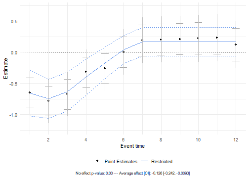

 

``` r
library(plausibounds)
```
## Dynamic Effect Plots

To understand the dynamic effects of a policy, it is common to summarize estimated effects over time in a dynamic effect (or event-study) plot. For example, a macroeconomist may estimate the response of the Consumer Price Index to a monetary shock via local projections, or a microeconomist may estimate the response of labor market outcomes to a change in welfare policies via distributed lag models.

## Overview

The `plausibounds` package provides simple additions to standard visualizations of dynamic treatment effects aimed at enhancing their informativeness. In particular, it provides functionality to:

* include joint hypothesis tests and summary measures that are often of direct interest alongside the standard event-study plot.

* compute a smooth approximation to the treatment-effect path from a prespecified, economically motivated class and produces corresponding confidence regions. The resulting intervals can be substantially tighter than conventional uniform bands while maintaining formal coverage guarantees through post-selection inference (Berk et al. [2013]).

## Background

We write $\theta=(\beta^{pre'},\beta')'$ for the $p \times 1$ vector that collects the elements of the dynamic treatment effect path depicted on the dynamic effect plot. Here, $\beta_{pre} = \{\beta^{pre}_h\}_{h={-L}}^{-1}$ denotes the displayed pre-event effects, $\beta=\{\beta_h\}_{h={1}}^{H}$ collects the dynamic treatment effect path after the event up to the fixed maximum horizon of interest $H$, and thus $p = H+L$. We assume access to point estimates of the parameters $\theta_h$, denoted by $\hat{\theta}_h$, that correspond to the cumulative effect of the policy at horizon $h$ relative to period 0. Throughout, we assume the vector that collects the estimated dynamic treatment effect path, $\hat\theta$, satisfies $\hat\theta \sim N(\theta,V_{\theta})$ and that we have access to the covariance matrix $V_{\theta}$. Leading examples to obtain such estimates include distributed lag models, local projections, and event studies.

The package takes $\hat{\theta}$ and $\hat{V}_{\theta}$ as input.

### Finding the surrogate path

The main contribution is to include new visual elements meant to depict approximations to the underlying effect path constrained to exhibit economically and statistically plausible shapes. Intuitively, these elements formalize "visual data snooping": Our proposal approximates looking at a dynamic effect plot and then choosing a specification that "captures the main dynamics." 
This specification should a) provide a notion of valid inference that explicitly accounts for the data-dependent choice of specification and b) use the full covariance structure of the estimates when choosing the specification.

Specifically, we construct *restricted estimates* and *plausible bounds* by using data-driven regularization to select an approximation to the treatment path from a pre-specified class of models. We consider a default universe of approximations motivated by a preference for (1) smooth dynamics that (2) eventually die out. The restricted estimates are the resulting regularized point estimates of the treatment path. Our plausible bounds are sup-t bands under the selected approximation, adjusted to account for data-dependent selection using Berk et al.'s [2013] post-selection inference (PoSI).

Intuitively, the plausible bounds represent a compromise between inference under no restrictions --- which may yield very wide confidence intervals --- and inference based on a single, prespecified model that does not adapt to the data and may therefore be overly restrictive.


The approach approximates $\hat{\beta}$ (assumed to be jointly normal with $\hat{\beta} \sim N(\beta, V_{\beta})$) by a *surrogate path* $\beta_M = P(M)\beta$, where $M$ indexes a model in a pre-specified universe $\mathcal{M}$. 
The model universe is specified as follows: it includes polynomial specifications (up to cubic) and penalized smoothing that shrinks first (effect eventually dies out) and third (effect is smooth) differences. 

Given estimates $\hat{\beta}$, the (non-polynomial) surrogate for a given model $M$ is obtained by solving a penalized least squares problem:

$$
\begin{align}
\tilde{\beta}(M)
&= \tilde{\beta}(\lambda_1, \lambda_2, K) \\
&= \arg\min_{b}\Bigg(
\underbrace{(\hat{\beta}-b)^{\prime}V^{-1}(\hat{\beta}-b)}_{\text{distance from $\hat{\beta}$}}
+\lambda_1\,\underbrace{b^{\prime}D_1^{\prime}W_1(K)D_1 b}_{\text{penalty on first difference after horizon $K$}}
+\lambda_2\,\underbrace{b^{\prime}D_3^{\prime}W_3 D_3 b}_{\text{penalty on third difference}}
\Bigg).
\end{align}
$$

where $D_1$ and $D_3$ are first- and third-difference operators, and $\lambda_1$, $\lambda_2$, and $K$ are tuning parameters that control smoothness and the timing of decay toward zero. The solution has closed form:

$$
\tilde{\beta}(M) = P(M)\hat{\beta}, \quad P(M) = \Big(V_\beta^{-1} + \lambda_1 D_1'W_1(K)D_1 + \lambda_2 D_3'W_3D_3\Big)^{-1} V_\beta^{-1}.
$$

Then, the best-fitting surrogate model $\hat{M}$ is selected by minimizing a BIC-type criterion:

$$
\hat{M} = \arg\min_{M \in \mathcal{M}} \; (\hat{\beta}-\tilde{\beta}(M))'V_\beta^{-1}(\hat{\beta}-\tilde{\beta}(M)) + \log(H)\,\text{df}(M),
$$

where the degrees of freedom is $\text{df}(M) = \mathrm{trace}(P(M))$. 
Therefore, the main algorithm of the package simply iterates over all models in the pre-specified universe to find $\hat{M}$. 

### Post-Selection Inference

Once $\hat{M}$ is chosen, the package constructs confidence regions using post-selection inference (Berk et al. 2013), which accounts for the model selection step:

$$
\Pr\!\big(\beta_{\hat{M}} \in \text{CR}_{\text{PoSI}}\big) \ge 1-\alpha.
$$


## Basic Usage

Let's start by examining the structure of the example datasets included in the package:


``` r
# Load example datasets
data(estimates_smooth)
data(var_smooth)

# Examine the data structures
print(estimates_smooth)
#>  [1] -0.17482676 -0.02004318 -0.10031844  0.07229334 -0.31769306  0.01454694
#>  [7]  0.06322594 -0.04186633  0.12340034 -0.04534908 -0.16169097 -0.20259667
#> [13] -0.03298893 -0.02878808 -0.11865547 -0.33781817 -0.04988252 -0.23286451
#> [19] -0.34721788 -0.31989801 -0.37015145 -0.18439333 -0.08283743 -0.06628430
#> [25]  0.07793498 -0.16041782  0.08020676 -0.26365956 -0.09156697 -0.08646877
#> [31]  0.17552747 -0.26331948  0.26817909  0.21390666  0.02886865 -0.03854033
#> [37] -0.17947818 -0.04629705 -0.26782818  0.03586062  0.17248994 -0.01214121
#> [43] -0.08781408  0.12013731
print(var_smooth[1:4, 1:4])
#>            [,1]       [,2]       [,3]       [,4]
#> [1,] 0.01981023 0.00000000 0.00000000 0.00000000
#> [2,] 0.00000000 0.01981023 0.00000000 0.00000000
#> [3,] 0.00000000 0.00000000 0.01981023 0.00000000
#> [4,] 0.00000000 0.00000000 0.00000000 0.01981023
```

The `estimates_smooth` vector contains 36 treatment effect estimates at different horizons and 8 preperiods. The `var_smooth` matrix is a diagonal variance matrix with no correlation between periods.

### Example 1: Independent Errors

A simple case uses the `plausible_bounds()` function with just the estimates and variance. The `alpha` parameter controls the confidence level (default is 0.05 for 95% confidence):


``` r
# Remove pretrends from the example dataset
estimates_smooth_nopretrends <- estimates_smooth[9:44]
var_smooth_nopretrends <- var_smooth[9:44, 9:44]

set.seed(916)

pb <- plausible_bounds(
  estimates = estimates_smooth_nopretrends,
  var = var_smooth_nopretrends
)
```

The returned object is a list containing the bounds, test statistics, and metadata. The `summary()` method extracts the key results in a tabular format, showing the horizon, original coefficient estimates, surrogate path, and restricted bounds for that path:


``` r
summary(pb)
#> Summary of Plausible Bounds Results
#> -----------------------------------
#> 
#>  horizon        coef   surrogate restr_lower   restr_upper
#>        1  0.12340034  0.05029379  -0.2819062  0.3824937465
#>        2 -0.04534908 -0.01242527  -0.2383862  0.2135356268
#>        3 -0.16169097 -0.06083759  -0.2497435  0.1280683432
#>        4 -0.20259667 -0.09671456  -0.2846543  0.0912251955
#>        5 -0.03298893 -0.12450103  -0.3145739  0.0655718335
#>        6 -0.02878808 -0.14990419  -0.3364671  0.0366587233
#>        7 -0.11865547 -0.17627685  -0.3569812  0.0044275224
#>        8 -0.33781817 -0.20310332  -0.3800159 -0.0261907311
#>        9 -0.04988252 -0.22699284  -0.4032329 -0.0507527280
#>       10 -0.23286451 -0.24373054  -0.4200712 -0.0673898601
#>       11 -0.34721788 -0.24771659  -0.4212750 -0.0741582232
#>       12 -0.31989801 -0.23460638  -0.3994920 -0.0697207153
#>       13 -0.37015145 -0.20399763  -0.3533966 -0.0545986687
#>       14 -0.18439333 -0.16031714  -0.2899628 -0.0306714683
#>       15 -0.08283743 -0.11228840  -0.2247302  0.0001534092
#>       16 -0.06628430 -0.06984725  -0.1753613  0.0356668159
#>       17  0.07793498 -0.04085456  -0.1491331  0.0674239407
#>       18 -0.16041782 -0.02840299  -0.1404036  0.0835976486
#>       19  0.08020676 -0.02831138  -0.1403457  0.0837229600
#>       20 -0.26365956 -0.02835239  -0.1403724  0.0836676030
#>       21 -0.09156697 -0.02833664  -0.1403591  0.0836857877
#>       22 -0.08646877 -0.02831674  -0.1403418  0.0837083324
#>       23  0.17552747 -0.02829484  -0.1403223  0.0837325887
#>       24 -0.26331948 -0.02828204  -0.1403116  0.0837475461
#>       25  0.26817909 -0.02825973  -0.1402913  0.0837717988
#>       26  0.21390666 -0.02824996  -0.1402832  0.0837833350
#>       27  0.02886865 -0.02825026  -0.1402851  0.0837846093
#>       28 -0.03854033 -0.02825289  -0.1402892  0.0837833835
#>       29 -0.17947818 -0.02825500  -0.1402925  0.0837824992
#>       30 -0.04629705 -0.02825160  -0.1402902  0.0837869723
#>       31 -0.26782818 -0.02824739  -0.1402869  0.0837920884
#>       32  0.03586062 -0.02823508  -0.1402753  0.0838051517
#>       33  0.17248994 -0.02822505  -0.1402659  0.0838157747
#>       34 -0.01214121 -0.02822171  -0.1402630  0.0838195630
#>       35 -0.08781408 -0.02821898  -0.1402605  0.0838225789
#>       36  0.12013731 -0.02821446  -0.1402562  0.0838272500
```

For a more detailed view of the object structure:


``` r
str(pb)
#> List of 8
#>  $ alpha                     : num 0.05
#>  $ preperiods                : num 0
#>  $ wald_test                 :List of 1
#>   ..$ post:List of 2
#>   .. ..$ statistic: num 62.9
#>   .. ..$ p_value  : num 0.00368
#>  $ restricted_bounds         :'data.frame':	36 obs. of  5 variables:
#>   ..$ horizon  : int [1:36] 1 2 3 4 5 6 7 8 9 10 ...
#>   ..$ coef     : num [1:36] 0.1234 -0.0453 -0.1617 -0.2026 -0.033 ...
#>   ..$ surrogate: num [1:36] 0.0503 -0.0124 -0.0608 -0.0967 -0.1245 ...
#>   ..$ lower    : num [1:36] -0.282 -0.238 -0.25 -0.285 -0.315 ...
#>   ..$ upper    : num [1:36] 0.3825 0.2135 0.1281 0.0912 0.0656 ...
#>  $ restricted_bounds_metadata:List of 8
#>   ..$ supt_critval      : num 3.17
#>   ..$ supt_b            : num 3.59
#>   ..$ degrees_of_freedom: num 4.14
#>   ..$ K                 : int 18
#>   ..$ lambda1           : num 22026
#>   ..$ lambda2           : num 77
#>   ..$ surrogate_class   : chr "M"
#>   ..$ best_fit_model    :List of 5
#>   .. ..$ estimates_proj: num [1:36] 0.0503 -0.0124 -0.0608 -0.0967 -0.1245 ...
#>   .. ..$ var_proj      : num [1:36, 1:36] 0.008577 0.005264 0.002701 0.000868 -0.000297 ...
#>   .. ..$ bic           : num 32
#>   .. ..$ model_fit_pval: num 0.459
#>   .. ..$ df            : num 4.14
#>  $ avg_treatment_effect      :List of 4
#>   ..$ estimate: num -0.0773
#>   ..$ se      : num 0.0235
#>   ..$ lower   : num -0.123
#>   ..$ upper   : num -0.0313
#>  $ pointwise_bounds          :List of 3
#>   ..$ lower  : num [1:36] -0.111 -0.282 -0.401 -0.444 -0.276 ...
#>   ..$ upper  : num [1:36] 0.3576 0.1912 0.0772 0.0386 0.2105 ...
#>   ..$ critval: num 1.96
#>  $ supt_bounds               :List of 3
#>   ..$ lower  : num [1:36] -0.259 -0.431 -0.552 -0.596 -0.43 ...
#>   ..$ upper  : num [1:36] 0.506 0.341 0.228 0.191 0.364 ...
#>   ..$ critval: num 3.2
#>  - attr(*, "class")= chr "plausible_bounds"
```

The object contains several components. The `restricted_bounds` data frame is identical to that produced with the `summary()` method.
The `restricted_bounds_metadata` list stores information about the model selection process, including the surrogate class selected (e.g., polynomial degree or penalized smoothing parameters), the degrees of freedom, and the sup-t critical value used in constructing the bounds.
The `avg_treatment_effect` component provides the average treatment effect estimate, its standard error, and confidence interval. 

When arguments `include_pointwise` and `include_supt` of `plausible_bounds()` are `TRUE` (the default), the object also contains `pointwise_bounds` and `supt_bounds` lists with the corresponding confidence bounds. 
Finally, `wald_test` contains test statistics and p-values for testing the joint null hypothesis of no treatment effect.


### Visualization with `create_plot()`

Next let's plot the results:


``` r
create_plot(pb)
```

<div class="figure" style="text-align: center">

<p class="caption">Plausible bounds for treatment path estimates with independent errors</p>
</div>

The plot displays several types of bounds and statistics, each serving a different inferential purpose:

**Point estimates (black dots)**: The original treatment effect estimates $\hat{\beta}_h$ at each horizon. 

**Restricted bounds (blue dashed lines)**: The main contribution of this package. These bounds provide uniform $(1-\alpha)$ coverage for the selected surrogate path (the smooth blue line), not the true treatment path itself. The surrogate path is chosen via BIC from the pre-specified model universe and represents a data-dependent smoothed approximation to the true treatment path. The restricted bounds adapt to the smoothness and correlation structure, often remaining narrower than sup-t intervals.

**Pointwise bounds (gray horizontal bars)**: Standard confidence intervals for each horizon separately, constructed as $\hat{\beta}_h \pm z_{1-\alpha/2} \sqrt{V_{\beta,hh}}$. 

**Sup-t bounds (gray vertical lines)**: Uniform confidence bands that provide $(1-\alpha)$ joint coverage of the entire treatment path. These are constructed using the supremum of $t$-statistics from individual coefficients. Guarantee full-path coverage but can become quite wide.

**Annotations**: The bottom of the plot shows several summary statistics. The "No effect p-value" comes from a Wald test of the null hypothesis that all treatment effects are zero. The "Average effect [CI]" provides the average treatment effect (ATE) $\bar{\beta} = \frac{1}{H}\sum_h \beta_h$ along with its confidence interval—this quantifies the overall magnitude of the treatment.

### Example 2: Correlated Errors

When errors are correlated across horizons (common in dynamic settings), the restricted bounds adapt to the correlation structure. While high correlation can widen the restricted bounds compared to the independent error case, they usually remain narrower than sup-t bands:


``` r
pb_corr <- plausible_bounds(
  estimates = estimates_bighump[1:12],
  var = var_bighump[1:12, 1:12],
  alpha = 0.05
)
```


``` r
create_plot(pb_corr)
```

<div class="figure" style="text-align: center">

<p class="caption">Plausible bounds for treatment path estimates with correlated errors</p>
</div>

## Pre-Treatment Periods

The package supports designs where some periods occur before treatment. This allows testing for pre-trends and distinguishing them from treatment effects. When specifying the `preperiods` argument, the function automatically computes two Wald tests: one testing $H_0$: no pre-trends in the pre-treatment periods, and another testing $H_0$: no treatment effect in the post-treatment periods. Both p-values appear in the plot annotations.

### Specifying Pre-Treatment Periods

Use the `preperiods` argument to indicate how many of the initial estimates correspond to pre-treatment periods. Note that period 0 (the period immediately before treatment) is assumed to be normalized to zero and should not be included in the estimates vector:


``` r
pb_pre <- plausible_bounds(
  estimates = estimates_smooth,
  var = var_smooth,
  alpha = 0.05,
  preperiods = 8  # First 8 elements are pre-treatment periods
)
```


``` r
create_plot(pb_pre)
```

<div class="figure" style="text-align: center">

<p class="caption">Event study with pre-treatment periods showing pre-trends</p>
</div>

The vertical dashed line at event time 0 separates pre- and post-treatment periods. Pre-treatment estimates appear at negative horizons, revealing any pre-existing trends. The restricted bounds and surrogate path are only computed for the post-treatment periods, since the goal is inference on the treatment effect path.

The annotations now include both Wald test p-values. The "Pretrends p-value" tests whether the pre-treatment coefficients are jointly zero—a rejection indicates violations of parallel trends. The "No effect p-value" tests whether the post-treatment coefficients are jointly zero. In this example, the pre-trends test rejects, suggesting that parallel trends may not hold.


## Customizing plots

The `create_plot()` function provides a few arguments to customize which elements appear in the plot. 
The `show_annotations` argument controls whether the Wald test results and average treatment effect are displayed at the bottom. 
The `show_supt` and `show_pointwise` arguments control whether sup-t and pointwise bounds are included. 
For a cleaner display focusing only on the restricted and pointwise bounds:


``` r
create_plot(pb, show_annotations = FALSE, show_pointwise = FALSE, show_supt = FALSE)
```

<div class="figure" style="text-align: center">

<p class="caption">Customized plot showing only point estimates and restricted bounds</p>
</div>


## Parallel Processing

For datasets with many horizons, the restricted bounds calculation can be time-consuming due to the model selection procedure. The `parallel` argument enables parallel computation across the model universe. Use `n_cores` to specify the number of cores (the default uses all available cores minus one):


``` r
pb_parallel <- plausible_bounds(
  estimates = estimates_smooth,
  var = var_smooth,
  alpha = 0.05,
  parallel = TRUE,
  n_cores = 4
)
```


## References

* Freyaldenhoven, S. and Hansen, C. (2025). "(Visualizing) Plausible Treatment Effect Paths." Federal Reserve Bank of Philadelphia and University of Chicago.
* Berk, R., Brown, L., Buja, A., Zhang, K., and Zhao, L. (2013). "Valid post-selection inference." *Annals of Statistics*, 41(2):802-837.
